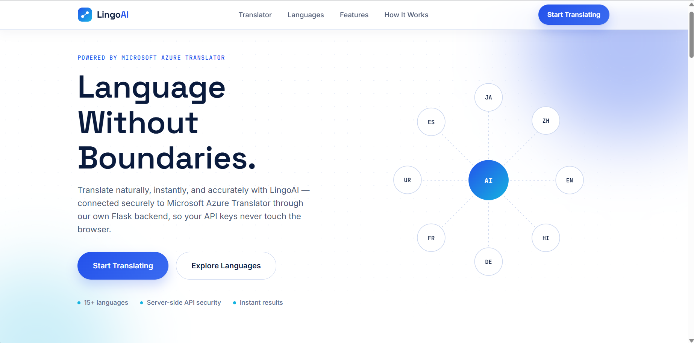
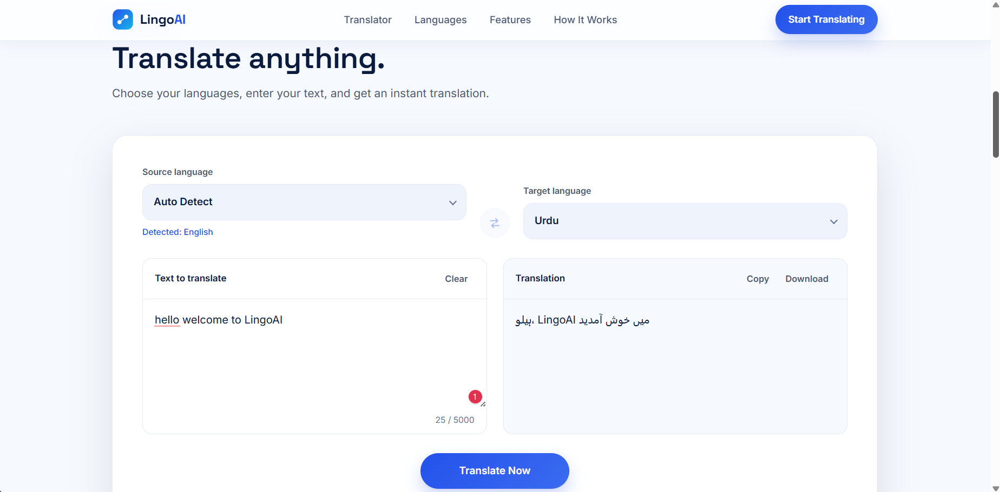
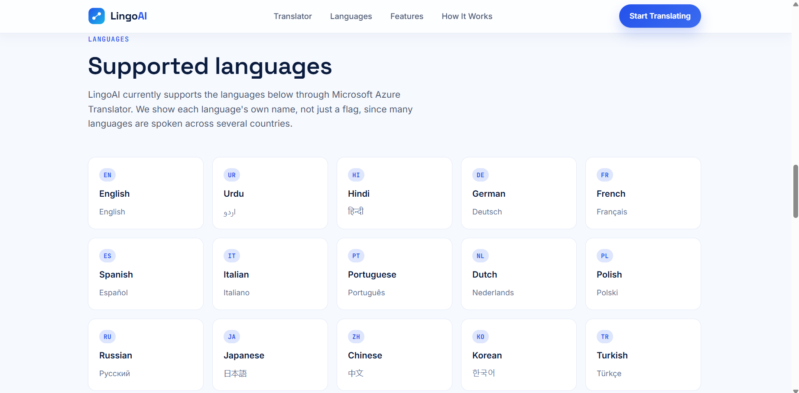
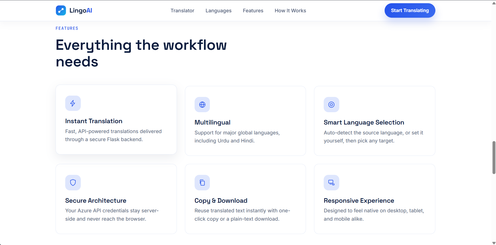

# \# 🌐 LingoAI — AI Language Translation Web App

# 

# \### CodeAlpha Artificial Intelligence Internship — Task 1

# 

# \*\*LingoAI\*\* is a modern, responsive language translation web application built as part of the \*\*CodeAlpha Artificial Intelligence Internship — Task 1: Language Translation Tool\*\*.

# 

# The application allows users to enter text, select source and target languages, and receive fast translations through \*\*Microsoft Azure Translator\*\*.

# 

# LingoAI uses a \*\*client → Flask backend → Azure Translator\*\* architecture, keeping sensitive translation credentials on the server instead of exposing them inside the browser.

# 

# \---

# 

# \## ✨ What is LingoAI?

# 

# LingoAI provides a clean SaaS-style interface for multilingual communication with features such as:

# 

# \* 🌍 15 supported languages

# \* 🤖 Microsoft Azure Translator integration

# \* 🔍 Automatic source-language detection

# \* 🔄 One-click language swapping

# \* ⚡ Fast translation requests

# \* 📋 Copy translated text

# \* 📥 Download translations as `.txt`

# \* 🔢 5,000-character input limit

# \* 📱 Fully responsive design

# \* ♿ Accessibility-focused interface

# \* 🔐 Server-side API credential protection

# 

# The frontend contains \*\*no Azure API keys\*\* and does not perform translation itself. All translation requests are securely handled by the Flask backend.

# 

# \---

# 

# \# 📸 Screenshots

# 

# \## 🏠 Home Page

# 

# 

# 

# \## 🔤 Translator

# 

# 


# 

# \## 🌍 Supported Languages

# 

# 

# 

# \## ⚡ Features

# 

# 

# 

# \---

# 

# \# 🎯 Project Purpose

# 

# This project fulfills the requirements of \*\*CodeAlpha Task 1 — Language Translation Tool\*\*.

# 

# The application provides:

# 

# \* A user interface for entering text.

# \* Source and target language selection.

# \* Source-language auto detection.

# \* API-based language translation.

# \* Clear display of translated results.

# \* Copy-to-clipboard functionality.

# \* Plain-text download functionality.

# \* Responsive design.

# \* Accessible user interactions.

# \* A dedicated Flask backend for communicating with the translation service.

# 

# \### Architecture

# 

# The frontend communicates only with:

# 

# ```text

# POST /api/translate

# ```

# 

# The Flask backend then communicates with Microsoft Azure Translator.

# 

# This keeps the translation provider credentials outside the browser.

# 

# \---

# 

# \# 🚀 Key Features

# 

# \## 🤖 Translation

# 

# \* Microsoft Azure Translator integration.

# \* Automatic source-language detection.

# \* 15 supported languages.

# \* Source and target language selectors.

# \* One-click language swapping.

# \* Automatically moves the previous translation into the source field when swapping.

# \* Maximum input length of \*\*5,000 characters\*\*.

# \* Live character counter.

# \* Translation loading state.

# \* Friendly validation and error messages.

# \* Detected-language display when Auto Detect is used.

# 

# \## 📋 Translation Actions

# 

# \*\*Clear\*\*

# 

# Removes the text from the input panel.

# 

# \*\*Copy\*\*

# 

# Copies the translated result directly to the clipboard.

# 

# \*\*Download\*\*

# 

# Downloads the translated result as:

# 

# ```text

# lingoai-translation.txt

# ```

# 

# \## 🎨 User Experience

# 

# \* Modern SaaS-inspired interface.

# \* Responsive desktop, tablet, and mobile layouts.

# \* Mobile navigation menu.

# \* Smooth section animations.

# \* Keyboard-friendly controls.

# \* `Ctrl + Enter` translation shortcut.

# \* Visible focus states.

# \* Accessible ARIA labels.

# \* `aria-live` translation status.

# \* Reduced-motion support.

# \* Custom inline SVG icons.

# \* No external icon library required.

# 

# \---

# 

# \# 🌍 Supported Languages

# 

# LingoAI currently supports \*\*15 languages\*\*:

# 

# | Code | Language   |

# | ---- | ---------- |

# | `en` | English    |

# | `ur` | Urdu       |

# | `hi` | Hindi      |

# | `de` | German     |

# | `fr` | French     |

# | `es` | Spanish    |

# | `it` | Italian    |

# | `pt` | Portuguese |

# | `nl` | Dutch      |

# | `pl` | Polish     |

# | `ru` | Russian    |

# | `ja` | Japanese   |

# | `zh` | Chinese    |

# | `ko` | Korean     |

# | `tr` | Turkish    |

# 

# The source language additionally supports:

# 

# ```text

# Auto Detect

# ```

# 

# \---

# 

# \# 🧠 How LingoAI Works

# 

# LingoAI follows a simple client-server architecture:

# 

# ```text

# ┌─────────────────────┐

# │        User         │

# │  Enters Text        │

# │  Selects Languages  │

# └──────────┬──────────┘

# &#x20;          │

# &#x20;          ▼

# ┌─────────────────────┐

# │   LingoAI Frontend  │

# │ HTML + CSS + JS     │

# └──────────┬──────────┘

# &#x20;          │

# &#x20;          │ POST /api/translate

# &#x20;          ▼

# ┌─────────────────────┐

# │    Flask Backend    │

# │      Python API     │

# └──────────┬──────────┘

# &#x20;          │

# &#x20;          │ Authenticated Request

# &#x20;          ▼

# ┌─────────────────────┐

# │ Microsoft Azure     │

# │     Translator      │

# └──────────┬──────────┘

# &#x20;          │

# &#x20;          │ Translation Response

# &#x20;          ▼

# ┌─────────────────────┐

# │    Flask Backend    │

# └──────────┬──────────┘

# &#x20;          │

# &#x20;          │ JSON Response

# &#x20;          ▼

# ┌─────────────────────┐

# │   LingoAI Frontend  │

# │  Displays Result    │

# └─────────────────────┘

# ```

# 

# \### Translation Flow

# 

# 1\. The user enters text.

# 2\. The user selects the source language.

# 3\. The user selects the target language.

# 4\. JavaScript validates the input.

# 5\. The frontend sends a `POST` request to Flask.

# 6\. Flask receives the translation request.

# 7\. Flask securely communicates with Azure Translator.

# 8\. Azure processes the text.

# 9\. Flask receives the translated result.

# 10\. Flask returns a JSON response.

# 11\. LingoAI displays the translation.

# 12\. The user can copy or download the result.

# 

# \---

# 

# \# 🛠️ Technology Stack

# 

# \## Frontend

# 

# \* HTML5

# \* CSS3

# \* Vanilla JavaScript

# \* CSS Grid

# \* Flexbox

# \* CSS Custom Properties

# \* JavaScript Fetch API

# \* ES2017+

# \* Async/Await

# \* Inline SVG

# 

# \## Backend

# 

# \* Python

# \* Flask

# \* Flask-CORS

# \* Requests

# \* python-dotenv

# 

# \## Translation Service

# 

# \* Microsoft Azure Translator

# 

# \## No Frontend Frameworks

# 

# LingoAI intentionally uses a lightweight frontend without:

# 

# \* React

# \* Vue

# \* Angular

# \* Bootstrap

# \* Tailwind CSS

# \* jQuery

# \* External icon libraries

# 

# This keeps the project simple, lightweight, and easy to understand.

# 

# \---

# 

# \# 📁 Project Structure

# 

# ```text

# LingoAI-Web/

# │

# ├── backend/

# │   ├── app.py

# │   ├── requirements.txt

# │   ├── .env

# │   └── .env.example

# │

# ├── frontend/

# │   ├── index.html

# │   ├── style.css

# │   ├── script.js

# │   ├── favicon.svg

# │   └── .gitignore

# │

# ├── screenshots/

# │   ├── Home-page.png

# │   ├── Translator.png

# │   ├── Languages.png

# │   └── Features.png

# │

# ├── .gitignore

# ├── start.bat

# └── README.md

# ```

# 

# > \*\*Important:\*\* `backend/.env` contains private Azure credentials and is intentionally excluded from Git.

# 

# \---

# 

# \# 🔌 API Configuration

# 

# The frontend communicates with the Flask backend through:

# 

# ```javascript

# const API\_BASE\_URL = "http://127.0.0.1:5000";

# const TRANSLATE\_ENDPOINT = `${API\_BASE\_URL}/api/translate`;

# ```

# 

# The browser \*\*never communicates directly with Microsoft Azure Translator\*\*.

# 

# Instead:

# 

# ```text

# Browser

# &#x20;  ↓

# Flask API

# &#x20;  ↓

# Azure Translator

# ```

# 

# This architecture keeps the Azure credentials on the backend.

# 

# \---

# 

# \# 📡 API Endpoint

# 

# \## POST `/api/translate`

# 

# \### Request

# 

# ```json

# {

# &#x20; "text": "Hello, how are you?",

# &#x20; "source": "en",

# &#x20; "target": "ur"

# }

# ```

# 

# \### Response

# 

# ```json

# {

# &#x20; "translation": "ہیلو، آپ کیسے ہیں؟",

# &#x20; "source": "en",

# &#x20; "target": "ur"

# }

# ```

# 

# \### Auto Detection

# 

# When the user selects \*\*Auto Detect\*\*, the frontend sends:

# 

# ```json

# {

# &#x20; "text": "Hello, how are you?",

# &#x20; "source": "auto",

# &#x20; "target": "ur"

# }

# ```

# 

# Azure detects the source language and Flask returns the detected language code.

# 

# The frontend then displays:

# 

# ```text

# Detected: English

# ```

# 

# \---

# 

# \# 🔐 Security

# 

# LingoAI uses a server-side credential architecture.

# 

# \### Protected

# 

# \* Azure API key

# \* Azure region

# \* Translation provider credentials

# 

# These are stored in:

# 

# ```text

# backend/.env

# ```

# 

# Example:

# 

# ```env

# AZURE\_TRANSLATOR\_KEY=your\_key\_here

# AZURE\_TRANSLATOR\_REGION=your\_region\_here

# ```

# 

# The repository also contains:

# 

# ```text

# backend/.env.example

# ```

# 

# which documents the required environment variables without exposing real credentials.

# 

# \### Security Principles

# 

# \* 🔒 API credentials remain server-side.

# \* 🚫 No Azure key exists in frontend JavaScript.

# \* 🚫 No Azure key exists in HTML or CSS.

# \* 🚫 The browser does not call Azure directly.

# \* 🔐 `.env` is excluded through `.gitignore`.

# \* ⚠️ Backend errors are converted into user-friendly frontend messages.

# 

# > \*\*Never commit your real `backend/.env` file or Azure API key to GitHub.\*\*

# 

# \---

# 

# \# ⚡ Running the Project

# 

# \## Option 1 — Quick Start

# 

# LingoAI includes:

# 

# ```text

# start.bat

# ```

# 

# This provides a simple way to start the project locally without manually entering every command.

# 

# Run:

# 

# ```text

# start.bat

# ```

# 

# Then follow the instructions shown in the terminal.

# 

# \---

# 

# \## Option 2 — Manual Setup

# 

# \### 1. Clone the repository

# 

# ```bash

# git clone https://github.com/Muhammad-Qas/CodeAlpha\_LingoAI.git

# ```

# 

# Enter the project directory:

# 

# ```bash

# cd CodeAlpha\_LingoAI

# ```

# 

# \---

# 

# \### 2. Configure Azure credentials

# 

# Open:

# 

# ```text

# backend/.env

# ```

# 

# and configure:

# 

# ```env

# AZURE\_TRANSLATOR\_KEY=your\_key\_here

# AZURE\_TRANSLATOR\_REGION=your\_region\_here

# ```

# 

# \---

# 

# \### 3. Install backend dependencies

# 

# Navigate to:

# 

# ```bash

# cd backend

# ```

# 

# Install the required packages:

# 

# ```bash

# pip install -r requirements.txt

# ```

# 

# \---

# 

# \### 4. Start Flask

# 

# Run:

# 

# ```bash

# python app.py

# ```

# 

# The backend will normally run at:

# 

# ```text

# http://127.0.0.1:5000

# ```

# 

# \---

# 

# \### 5. Start the frontend

# 

# Open another PowerShell window and navigate to:

# 

# ```text

# CodeAlpha\_LingoAI\\frontend

# ```

# 

# Run:

# 

# ```bash

# python -m http.server 5500

# ```

# 

# Then open:

# 

# ```text

# http://127.0.0.1:5500

# ```

# 

# The frontend is already configured to communicate with:

# 

# ```text

# http://127.0.0.1:5000

# ```

# 

# \---

# 

# \# 🧩 Three-Step User Workflow

# 

# \### 01 — Enter Text

# 

# Type or paste up to \*\*5,000 characters\*\* into the source panel.

# 

# \### 02 — Choose Languages

# 

# Select a source language or use \*\*Auto Detect\*\*, then select the target language.

# 

# \### 03 — Translate

# 

# Click \*\*Translate Now\*\*.

# 

# LingoAI sends the request through:

# 

# ```text

# Frontend → Flask → Azure Translator → Flask → Frontend

# ```

# 

# The translated result can then be copied or downloaded.

# 

# \---

# 

# \# ♿ Accessibility

# 

# Accessibility was considered throughout the interface.

# 

# LingoAI includes:

# 

# \* Semantic HTML controls.

# \* Accessible navigation labels.

# \* Visible keyboard focus states.

# \* `aria-live` translation status.

# \* `role="alert"` error messages.

# \* Keyboard translation shortcut.

# \* Responsive mobile navigation.

# \* `prefers-reduced-motion` support.

# \* Accessible buttons and form controls.

# \* Responsive layouts for different screen sizes.

# 

# \---

# 

# \# 📱 Responsive Design

# 

# The interface is designed for:

# 

# \* 📱 Mobile phones

# \* 📲 Tablets

# \* 💻 Laptops

# \* 🖥️ Desktop displays

# 

# The layout uses CSS Grid, Flexbox, responsive breakpoints, and a mobile navigation system to adapt across screen sizes.

# 

# \---

# 

# \# 🔮 Future Improvements

# 

# Possible future enhancements include:

# 

# \* 📝 Translation history.

# \* 🔊 Text-to-speech playback.

# \* 📚 Batch translation.

# \* 🌐 Browser-based language suggestions.

# \* 👤 User accounts.

# \* 💾 Persistent translation history.

# \* ⚡ Production deployment.

# \* 🛡️ Authentication and rate limiting.

# \* 📊 Usage analytics.

# 

# \---

# 

# \# 🎓 CodeAlpha Internship

# 

# This project was developed for:

# 

# \*\*CodeAlpha Artificial Intelligence Internship\*\*

# 

# \### Task 1 — Language Translation Tool

# 

# The project demonstrates:

# 

# \* Frontend development

# \* REST API communication

# \* Python Flask backend development

# \* Third-party API integration

# \* Server-side credential handling

# \* Responsive UI design

# \* Accessibility considerations

# \* Git and GitHub project management

# 

# \---

# 

# \# 👨‍💻 Author

# 

# \### Muhammad Qas

# 

# \*\*AI / Machine Learning Enthusiast • Full-Stack Developer\*\*

# 

# Built as part of the \*\*CodeAlpha Artificial Intelligence Internship — Task 1\*\*.

# 

# \---

# 

# \# 📄 Project Status

# 

# \*\*Status: ✅ Completed\*\*

# 

# LingoAI is currently an \*\*internship and portfolio demonstration project\*\*.

# 

# It is not intended to be a production-grade translation platform and currently does not include authentication, database persistence, rate limiting, or production monitoring.

# 

# \---

# 

# \## ⭐ If you like the project

# 

# Feel free to explore the repository, review the architecture, and experiment with the LingoAI translation workflow.

# 

# \*\*LingoAI — Language Without Boundaries. 🌍\*\*


